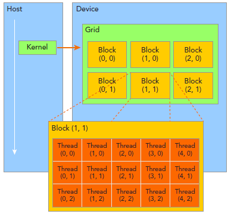
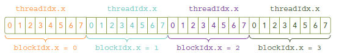

# 编译
```bash
nvcc -g -G -o test kernel.cu
```
-G是cuda-gdb Debug选项
# 关键字
- __global__ 主机调用设备端，运行在GPU端
- __device__ 设备端调用设备端
# 组织线程
组织线程是CUDA编程的重要部分。CUDA线程分成Grid和Block两个层次


由一个单独的kernel启动的所有线程组成一个grid，grid中所有线程共享global memory。一个grid由许多block组成，block由许多线程组成，grid和block都可以是一维二维或者三维，上图是一个二维grid(3x2)和二维block(5x3)

这里介绍几个CUDA内置变量：

- blockIdx：block的索引，blockIdx.x表示block的x坐标。
- threadIdx：线程索引，同理blockIdx。
- blockDim：block维度，上图中blockDim.x=5.
- gridDim：grid维度

# 核函数样型
```c
__global__ void kernel_func<<<block数量4,block线程数8>>(argument list);
```
该行代码表明有grid为一维，有4个block，block为一维，每个block有8个线程，故此共有4*8=32个线程。
```c
idx = blockIdx.x*blockDim.x + threadIdx.x
```


## 核函数限制

- 不能向主机返回变量，故使用void作为返回值
- 仅能获取device memory,不能访问主机内存。使用cudaMalloc分配设备内存
- 不支持静态变量，不支持**函数**指针
- 异步
