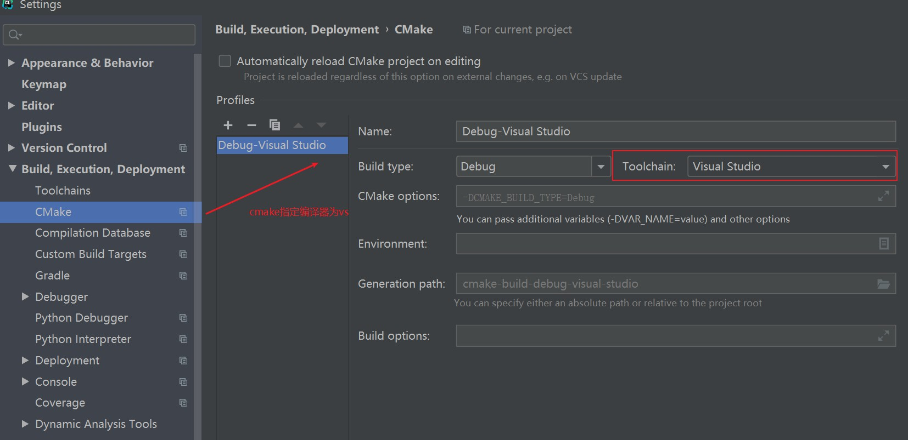
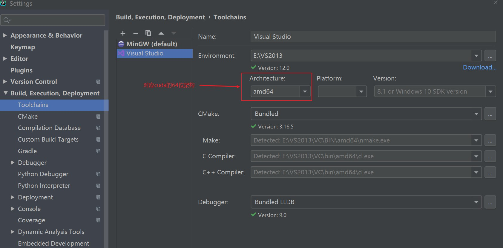
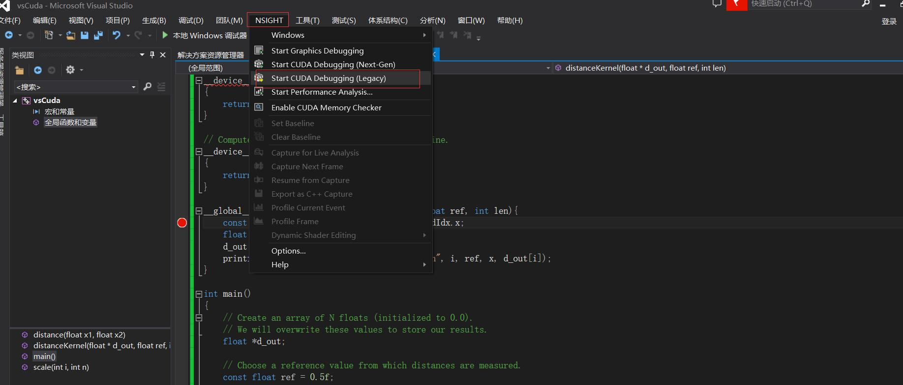

# 电脑的linux虚拟机没有GPU，只能用vs在Windows上跑.cu
https://zhuanlan.zhihu.com/p/488518526

# 使用clion构建开发环境
- clion搭配mingw编译器跑不通，必须用vs
- clion创建cuda项目
  - 设置cmake的toolchain为vs
  
  - 设置toolchain的vs版本为64位，与cuda保持一致
 

 支持linux上的cuda-gdb调试
 https://www.jetbrains.com/help/clion/cuda-projects.html#cuda-gdb-debugger

 # vs可以用Nsight对核函数进行调试
 - 创建cuda项目
 